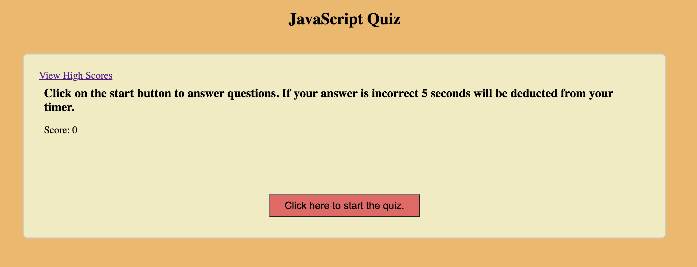

# JavaScript Quiz

## Simple JavaScript program to show and evaluate a quiz

## Features

- Gives the user one question at a time
- Once the user selects the answer, it evaluates and prints if the answer is correct or not on the screen.
- Once the user answers a question, the next question is automatically shown on the screen without having to click the next button
- After all the questions are answered, the user is prompted to enter their initials and submit
- The initials and the score is saved to the local variables
- There is a link to the high scores which shows all the scores for the user so far

## [View the website here](https://cguntur.github.io/code_quiz/)

